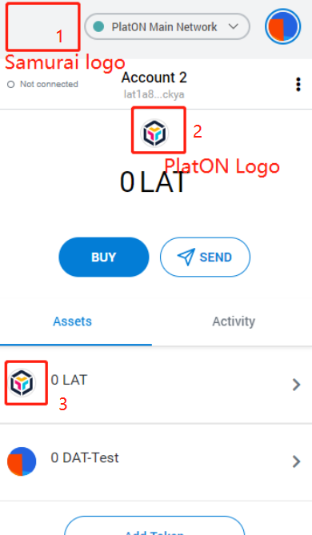

# Bonuty#211011 - Fix the display error of Samurai's Logo
## Specific requirements

1.  Fix the display of Samurai's Logo, that is, display Samurai's Logo in place 1.

2. When selecting "PlatON Main Network", the LAT logo should be displayed at places 2 and 3 on the picture; similarly, when selecting "Alaya Main Network", the ATP logo should be displayed there. 

    You can find the logo information of LAT and ATP [here](https://github.com/LatticeX-Foundation/Brand-Assets/tree/master/). 

   Note: The currency logo of the development network is the same as that of the main network.

   

## Task submission

   Here is the issue of this task: https://github.com/AlayaNetwork/Samurai/issues/10. You need to submit the task in the following way.

- **Submit code:** You are expected to submit your complete code via PR on Github to fix this issue. The first and correctly completed PR shall prevail.
- **Submit test verification results:** In order to quickly and easily verify your results, you are expected to provide a verifiable test Samurai version and test report under this task post.

## Reward distribution

The total reward of this task is 1000 USDT, which will be issued after the results are verified and the codes are merged.

**Brothers, please show your code! :100:**
